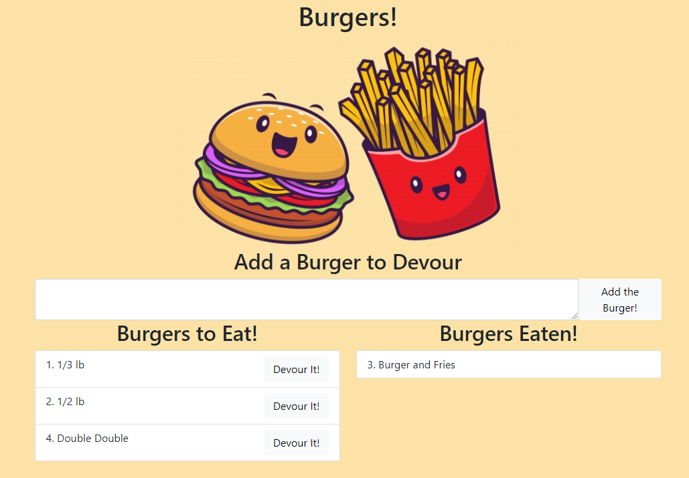

# EatDaBurger

  
  
  
  

##Table of Contents
* [Description](#description)
* [Usage](#usage)
* [Questions](#questions)
* [License](#license)

## Description
A burger logger created with MySQL, Node, Express, and Handlebars. This application allows the user to add burgers to a database, and to devour the burgers added. Click [here](https://lemoine-eat-da-burger.herokuapp.com/) to see the deployed site.

## Usage
To use this application:
* Open the application by clicking [here](https://lemoine-eat-da-burger.herokuapp.com/)
* Enter a burger name in the text field
* Click Add the Burger! to add it to the Burgers to Eat! column
* Click Devour It! on any of the burgers in the Burgers to Eat! column to move it the the Burgers Eaten! column

## Questions
To get in contact with me please see my Github [here](https.github.com/undefined), or [email me](mailto:undefined)!

## License
Copyright 2021 Amanda LeMoine

Permission is hereby granted, free of charge, to any person obtaining a copy of this software and associated documentation files (the "Software"), to deal in the Software without restriction, including without limitation the rights to use, copy, modify, merge, publish, distribute, sublicense, and/or sell copies of the Software, and to permit persons to whom the Software is furnished to do so, subject to the following conditions:

The above copyright notice and this permission notice shall be included in all copies or substantial portions of the Software.

THE SOFTWARE IS PROVIDED "AS IS", WITHOUT WARRANTY OF ANY KIND, EXPRESS OR IMPLIED, INCLUDING BUT NOT LIMITED TO THE WARRANTIES OF MERCHANTABILITY, FITNESS FOR A PARTICULAR PURPOSE AND NONINFRINGEMENT. IN NO EVENT SHALL THE AUTHORS OR COPYRIGHT HOLDERS BE LIABLE FOR ANY CLAIM, DAMAGES OR OTHER LIABILITY, WHETHER IN AN ACTION OF CONTRACT, TORT OR OTHERWISE, ARISING FROM, OUT OF OR IN CONNECTION WITH THE SOFTWARE OR THE USE OR OTHER DEALINGS IN THE SOFTWARE.